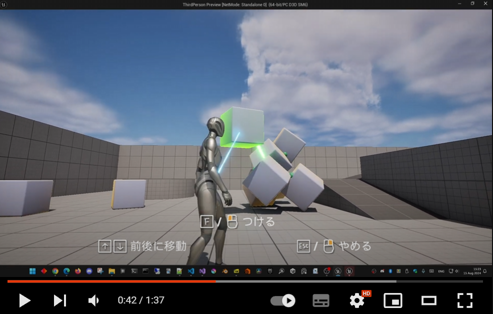

# Ultra Hand
- The Idea inspired from "The Legend of Zelda: Tears of the Kingdom"
## Features
- Grab object
- Highlight nearby attachable objects
- Attach objects and create bonding (Glue)
- Break attached objects

---------
### Demo video on Youtube

## How To Play
| Action                                | Keyboard & Mouse | PS Controller | XBox Controller |
|---------------------------------------|------------------|---------------|-----------------|
| Move Character                        | W,A,S,D          | Left Stick    | Left Stick      |
| Pan Camera                            | Mouse            | Right Stick   | Right Stick     |
| Jump                                  | Space            | X             | A               |
| Grab Target Object                    | F or LMB         | ☐            | X               |
| Fuse Attach Objects together          |                  | ☐            | X               |
| Release Object                        | ESC or RMB       | ◯            | B               |
| Move Object Forward / Back            | Up / Down        | Up / Down     | Up / Down       |
| Break Attached from Current Target    | B                | R1            | RB              |
------

## Tech
- Move object smoothly with damping
- Do sweep trace in async mode if possible
- Consider attached objects as single group when doing movement or collision detection
- Re-group objects base on connection after some object removed from the group
- Do Sliding along collied plane when moving grabbed target object for better UX

-----
This project is base on Template taken from Unreal Engine "5.4.2 Release".  
https://github.com/EpicGames-Mirror-A/UnrealEngine/
